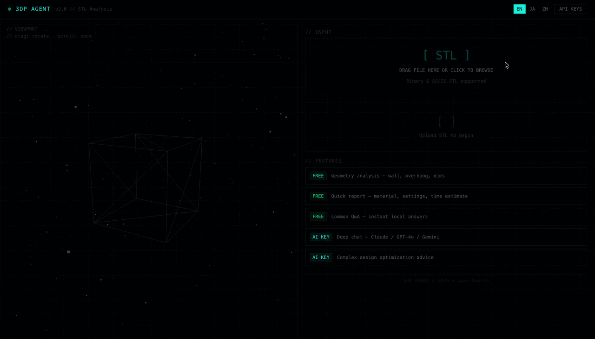

cd "/Users/bougiezoe/Desktop/3DP Agent - bougiezoe" && \
git remote set-url origin https://github.com/BougieZoe/3DP-Agent-.git && \
git pull origin main --no-rebase && \
cat > README.md << 'EOF'
# 3DP AGENT
### a place to see, feel, and question a 3D print before it exists

<div align="center">
  
</div>

<p align="center">
  <a href="https://3dp-agent.vercel.app"></a>
  <a href="https://github.com/BougieZoe/3DP-Agent-/blob/main/LICENSE"></a>
  <a href="https://github.com/BougieZoe/3DP-Agent-/stargazers"></a>
  
  
</p>

**live → [3dp-agent.vercel.app](https://3dp-agent.vercel.app)** · open in browser, no install, no cloud

---

## what it is

A quiet tool for people who work with STL files.  
It reads your model, shows it in space, and talks back — in plain words, not g‑code.

- **zero upload** → everything stays in your browser  
- **free analysis** → wall thickness, overhang, volume  
- **two modes** → local rules (fast) / optional AI chat (deeper)  
- **three languages** → EN / 日本語 / 中文

No login. No database. No subscription.

---

## how it works

```mermaid
%%{init: {'theme': 'base', 'themeVariables': { 'primaryColor': '#a3c4f3', 'primaryBorderColor': '#2c5aa6', 'lineColor': '#5a8ddf'}}}%%
flowchart LR
    User[User] -->|drag STL| Browser[Browser App]
    Browser --> STL[STL Loader]
    Browser --> Rules[Rule Engine]
    Rules -->|fast path| Result[Local Analysis<br/>thickness, overhang, volume]
    Rules -->|needs AI| AI[External AI API]
    AI --> Claude[Claude / GPT-4o / Gemini]
    Result --> Report[Printable Report]
    Claude --> Chat[AI Chat Answer]
