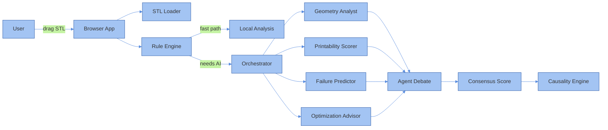

# 3DP AGENT

### a place to see, feel, and question a 3D print before it exists


[](https://3dp-agent.vercel.app) [](https://github.com/BougieZoe/3DP-Agent-/blob/main/LICENSE) [](https://github.com/BougieZoe/3DP-Agent-/stargazers) [](https://react.dev) [](https://threejs.org)

**live → [3dp-agent.vercel.app](https://3dp-agent.vercel.app)**

---

Upload an STL. Watch it think. Ask it anything.

No account. No cloud. No waiting. Everything runs in your browser.

---

## what it does

**instant — no key needed**

Drop a file. In seconds you get:

| | |
|:--|:--|
| wall thickness | catches regions too thin to survive printing |
| overhang | flags faces beyond 45° — support territory |
| volume & mass | material usage, weight estimate |
| dimensions | exact XYZ in mm |
| watertight check | open mesh detection |
| quick report | settings, material, time — instant |

**multi-agent AI — your key, your choice**

Four specialized agents analyze your model in parallel, then debate their findings:

| agent | what it sees |
|:--|:--|
| Geometry Analyst | mesh topology, wall thickness, overhangs, features |
| Printability Scorer | weighted score across all risk dimensions |
| Failure Predictor | where and why it will fail |
| Optimization Advisor | what to change and how |

They produce a **CONSENSUS SCORE** — not just one AI's opinion, but a structured disagreement resolved into a verdict.

Point it at Claude, OpenAI, or Gemini. Your key stays in your browser. Nothing leaves your machine.

---

## causality

Most tools tell you *what* is wrong. This one tries to tell you *why*.

The **CAUSALITY** tab traces failure chains — from geometry decision to print outcome. It shows manufacturing timelines, counterfactual reasoning ("if you thickened this wall, here's what changes"), and pattern memory across your session.

---

## the visual layer

The 3D viewport isn't just a model viewer. It's an argument made visible.

Overlays animate in real time as analysis runs:

- **Cognitive Scan** — a plane sweeps the model as the AI reads it
- **Risk Animation** — risk markers breathe with severity
- **Thermal Field** — heat distribution across the surface
- **Failure Emergence** — sagging, oscillation, stress pulses appear where failure is predicted
- **Layer Reveal** — watch the print build layer by layer
- **Print Path Preview** — the head traces its actual path

Switch between **dark and light** themes. The entire visual system — Three.js scene, UI tokens, animation constants — reacts.

---

## how it works



---

## stack

React 19 · TypeScript · Three.js · React Three Fiber
Tailwind v4 · Vite 7 · multi-agent orchestration

---

## run it

```bash
git clone https://github.com/BougieZoe/3DP-Agent-
cd 3DP-Agent-
pnpm install
pnpm dev
```

Add your AI key inside the app. Everything else works out of the box.

---

## who it's for

Designers catching issues before handoff.
Engineers who want a second opinion fast.
Manufacturers reviewing files before they quote.
Anyone who's had a print fail and didn't know why.

---

## roadmap

- [ ] PDF export
- [ ] slicer settings output
- [ ] batch analysis
- [ ] cost estimation by material

---

## license

MIT. If this saves you a failed print, a ⭐ is appreciated.

---

*EN · 日本語 · 中文 · [@BougieZoe](https://github.com/BougieZoe)*
