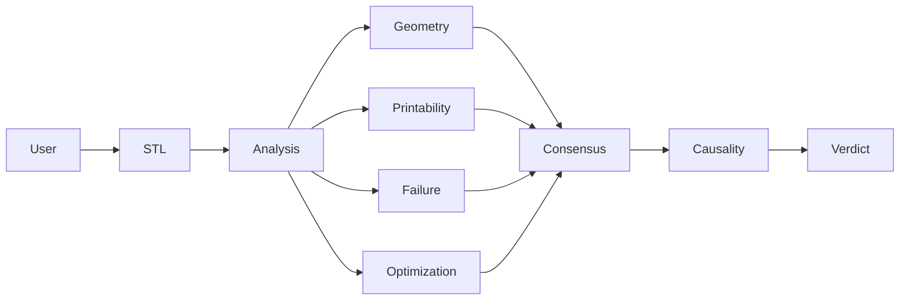

# 3DP AGENT

### Upload an STL. Watch it think. Ask it anything.

A multi-agent AI system that predicts 3D printing failures before you waste time, material, and money.


[Live Demo](https://3dp-agent.vercel.app) · [GitHub](https://github.com/BougieZoe/3DP-Agent-) · MIT License

---

## Why It Exists

Most print failures are visible before printing begins.

Thin walls.
Dangerous overhangs.
Hidden geometry defects.
Weak structural regions.

The problem is that most people don't see them until hours later — after the machine, material, and time have already been spent.

3DP Agent analyzes a model before it becomes a failed print.

Upload an STL.

Get a second opinion from four specialized AI agents.

---

## What It Does

Drop in an STL file and receive:

| Analysis | Description |
|-----------|-------------|
| Wall Thickness | Detects regions too thin to print reliably |
| Overhang Detection | Identifies support-heavy geometry |
| Dimensions | Exact XYZ measurements |
| Volume & Mass | Material usage estimates |
| Watertight Check | Open mesh detection |
| Printability Score | Overall manufacturing readiness |
| Failure Prediction | Where and why a print may fail |
| Optimization Advice | Recommended fixes and improvements |

No account required.

Local analysis works immediately.

---

## Multi-Agent Reasoning

Instead of relying on a single AI response, 3DP Agent uses a team of specialized agents.

| Agent | Responsibility |
|---------|---------|
| Geometry Analyst | Understands mesh structure and topology |
| Printability Scorer | Evaluates manufacturing readiness |
| Failure Predictor | Identifies likely failure points |
| Optimization Advisor | Suggests design improvements |

Each agent reviews the model independently.

Their findings are debated and merged into a final consensus verdict.

```text
Geometry Analysis
        ↓
Printability Review
        ↓
Failure Prediction
        ↓
Optimization Pass
        ↓
Consensus Verdict
```

The result is not a single opinion.

It is a structured agreement formed from multiple perspectives.

---

## Causality Engine

Most analysis tools stop at:

"Something is wrong."

3DP Agent continues with:

"Why is it wrong?"

The Causality Engine traces failure chains from geometry decisions to manufacturing outcomes.

Examples:

- If this wall becomes thicker, what changes?
- If supports are removed, where will failure begin?
- Which design decision created this risk?
- What is the cheapest fix?

The goal is explanation, not just detection.

---

## Visual Intelligence

Analysis is visualized directly on the model.

The viewport acts as a live reasoning surface.

Available visual layers:

- Cognitive Scan
- Risk Animation
- Thermal Field
- Failure Emergence
- Layer Reveal
- Print Path Preview

Instead of reading a report, users can watch the model explain itself.

---

## Architecture



---

## Technology

Built with:

- React 19
- TypeScript
- Three.js
- React Three Fiber
- Tailwind CSS
- Vite

AI providers:

- OpenAI
- Claude
- Gemini

Provider keys remain client-side.

---

## AMD Acceleration

For large-scale AI analysis, 3DP Agent can run on AMD Instinct MI300X GPUs through ROCm and vLLM.

The AMD deployment powers the multi-agent reasoning pipeline used during the AMD Developer Hackathon submission.

Features:

- Qwen models served through vLLM
- AMD Instinct MI300X acceleration
- Server-side proxy architecture
- Containerized deployment

This section is optional for end users.

The product functions without AMD infrastructure.

---

## Run Locally

```bash
git clone https://github.com/BougieZoe/3DP-Agent-
cd 3DP-Agent-

pnpm install
pnpm dev
```

Open:

http://localhost:3000

---

## Docker

```bash
docker build -t 3dp-agent .

docker run \
-p 3000:3000 \
-e AMD_MACHINE_URL=<endpoint> \
3dp-agent
```

---

## Roadmap

- PDF Export
- Slicer Presets
- Batch Analysis
- Cost Estimation
- Manufacturing Knowledge Graph
- Historical Failure Memory

---

## Who It's For

- Product Designers
- Mechanical Engineers
- Manufacturing Teams
- 3D Printing Enthusiasts
- Rapid Prototyping Labs

Anyone who has ever asked:

"Will this print actually work?"

---

## License

MIT

If 3DP Agent saves you a failed print, consider giving the project a star.
