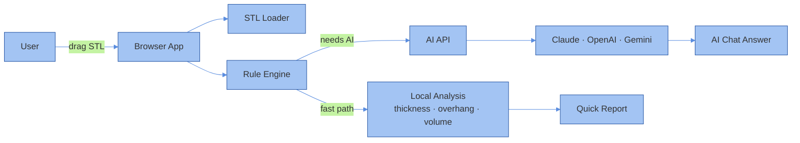

# 3DP AGENT

### a place to see, feel, and question a 3D print before it exists


[](https://3dp-agent.vercel.app) [](https://github.com/BougieZoe/3DP-Agent-/blob/main/LICENSE) [](https://github.com/BougieZoe/3DP-Agent-/stargazers) [](https://react.dev) [](https://threejs.org)

**live → [3dp-agent.vercel.app](https://3dp-agent.vercel.app)**

---

Upload an STL. See it move. Ask it questions.

No account. No cloud. No waiting. Everything runs in your browser.

---

## what it does

**free — no key needed**

| | |
|:--|:--|
| wall thickness | catches regions too thin to survive printing |
| overhang | flags faces beyond 45° — support territory |
| volume & mass | material usage, weight estimate |
| dimensions | exact XYZ in mm |
| watertight | open mesh detection |
| quick report | settings, material, time — instant |

**AI chat — your key, your choice**

Point it at Claude, OpenAI, or Gemini. Ask what you actually want to know:

> *"Where will this warp?"*
> *"Is PETG the right call here?"*
> *"How do I get rid of most of the support?"*

The AI sees the real geometry — not just the filename. Your key stays in your browser. Nothing leaves your machine.

---

## how it works



---

## stack

```
React 19 · TypeScript · Three.js · React Three Fiber · Tailwind v4 · Vite 7
```

---

## run it

```bash
git clone https://github.com/BougieZoe/3DP-Agent-
cd 3DP-Agent-
pnpm install
pnpm dev
```

Add your AI key inside the app. Everything else works out of the box.

---

## who it's for

Designers catching issues before handoff.
Engineers who want a second opinion fast.
Manufacturers reviewing files before they quote.
Anyone who's had a print fail and didn't know why.

---

## roadmap

- [ ] PDF export
- [ ] slicer settings output
- [ ] batch analysis
- [ ] cost estimation by material

---

## license

MIT. If this saves you a failed print, a ⭐ is appreciated.

---

*EN · 日本語 · 中文 · [@BougieZoe](https://github.com/BougieZoe)*
