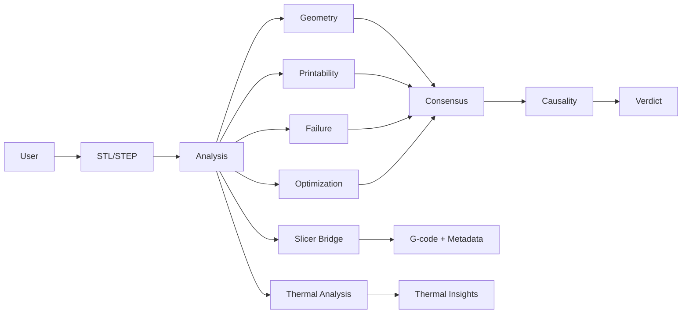

# 3DP AGENT

### Upload an STL. Watch it think. Ask it anything.

A multi-agent AI system that predicts 3D printing failures before you waste time, material, and money.


[Live Demo](https://3dp-agent.vercel.app) · [GitHub](https://github.com/BougieZoe/3DP-Agent-) · MIT License

---

## Why It Exists

Most print failures are visible before printing begins.

Thin walls.
Dangerous overhangs.
Hidden geometry defects.
Weak structural regions.

The problem is that most people don't see them until hours later — after the machine, material, and time have already been spent.

3DP Agent analyzes a model before it becomes a failed print.

Upload an STL.

Get a second opinion from four specialized AI agents.

---

## What It Does

Drop in an STL file and receive:

| Analysis | Description |
|-----------|-------------|
| Wall Thickness | Detects regions too thin to print reliably |
| Overhang Detection | Identifies support-heavy geometry |
| Dimensions | Exact XYZ measurements |
| Volume & Mass | Material usage estimates |
| Watertight Check | Open mesh detection |
| Printability Score | Overall manufacturing readiness |
| Failure Prediction | Where and why a print may fail |
| Optimization Advice | Recommended fixes and improvements |
| **Slicer Integration** | **Real G-code generation via PrusaSlicer/OrcaSlicer** |
| **STEP Input** | **Direct CAD file analysis via OpenCASCADE WASM** |
| **Thermal Analysis** | **Material-specific thermal behavior prediction** |

No account required.

Local analysis works immediately.

---

## Multi-Agent Reasoning

Instead of relying on a single AI response, 3DP Agent uses a team of specialized agents.

| Agent | Responsibility |
|---------|---------|
| Geometry Analyst | Understands mesh structure and topology |
| Printability Scorer | Evaluates manufacturing readiness |
| Failure Predictor | Identifies likely failure points |
| Optimization Advisor | Suggests design improvements |

Each agent reviews the model independently.

Their findings are debated and merged into a final consensus verdict.

```text
Geometry Analysis
        ↓
Printability Review
        ↓
Failure Prediction
        ↓
Optimization Pass
        ↓
Consensus Verdict
```

The result is not a single opinion.

It is a structured agreement formed from multiple perspectives.

---

## Causality Engine

Most analysis tools stop at:

"Something is wrong."

3DP Agent continues with:

"Why is it wrong?"

The Causality Engine traces failure chains from geometry decisions to manufacturing outcomes.

Examples:

- If this wall becomes thicker, what changes?
- If supports are removed, where will failure begin?
- Which design decision created this risk?
- What is the cheapest fix?

The goal is explanation, not just detection.

---

## Visual Intelligence

Analysis is visualized directly on the model.

The viewport acts as a live reasoning surface.

Available visual layers:

- Cognitive Scan
- Risk Animation
- Thermal Field
- Failure Emergence
- Layer Reveal
- Print Path Preview

Instead of reading a report, users can watch the model explain itself.

---

## Slicer Integration (S1c, S1b)

3DP Agent integrates with real slicer CLIs to generate accurate print predictions:

### Supported Slicers

| Slicer | Status | Notes |
|--------|--------|-------|
| **PrusaSlicer** | ✅ Full | Auto-discovery, G-code parsing |
| **OrcaSlicer** | ✅ Full | 3MF extraction, large-format support |
| **BambuStudio** | 🔲 Planned | Same CLI as PrusaSlicer |

### Features

- **Real G-code generation** with accurate print time and filament estimates
- **Layer-by-layer analysis** from actual slicer output
- **Material-specific profiles** for PLA, ABS, PETG, TPU, Nylon, PC
- **Large-format printer support** (Bambu Lab H2D/H2D Pro: 350x350x350mm)
- **Auto bed normalization** for optimal print orientation

### API

```bash
# Health check
curl http://localhost:3001/api/slice/health

# Slice an STL
curl -X POST http://localhost:3001/api/slice \
  -H "Content-Type: application/json" \
  -d '{"stlBase64": "<base64-encoded-stl>", "slicer": "prusaslicer"}'
```

---

## STEP Input Support (D1)

3DP Agent can directly analyze STEP files using OpenCASCADE WASM:

### Features

- **Direct STEP file import** without manual STL conversion
- **Accurate geometry extraction** with proper B-REP to mesh conversion
- **Metadata extraction** from STEP headers (author, organization, etc.)
- **Configurable tessellation** (linear/angular deflection)

### API

```bash
# Health check
curl http://localhost:3001/api/step/health

# Parse a STEP file
curl -X POST http://localhost:3001/api/step \
  -H "Content-Type: application/json" \
  -d '{"stepBase64": "<base64-encoded-step>"}'
```

---

## Thermal Analysis (S2)

Advanced thermal behavior prediction for FDM printing:

### Material Database

| Material | Glass Transition | Thermal Conductivity | Shrinkage |
|----------|------------------|---------------------|-----------|
| PLA | 60°C | 0.13 W/m·K | 0.2% |
| ABS | 105°C | 0.17 W/m·K | 0.8% |
| PETG | 80°C | 0.24 W/m·K | 0.4% |
| TPU | -40°C | 0.15 W/m·K | 0.3% |
| Nylon | 50°C | 0.25 W/m·K | 1.0% |
| PC | 147°C | 0.20 W/m·K | 0.7% |

### Capabilities

- **Per-layer thermal modeling** using Newton's law of cooling
- **Warping risk assessment** based on material shrinkage and geometry
- **Heat accumulation detection** for thin sections and bridges
- **Material-specific recommendations** (bed temp, enclosure, orientation)

---

## Architecture


```mermaid
flowchart LR

User --> STL[STL/STEP]

STL --> Analysis

Analysis --> Geometry
Analysis --> Printability
Analysis --> Failure
Analysis --> Optimization
Analysis --> Slicer[Slicer Bridge]
Analysis --> Thermal[Thermal Analysis]

Geometry --> Consensus
Printability --> Consensus
Failure --> Consensus
Optimization --> Consensus
Slicer --> GCode[G-code + Metadata]
Thermal --> ThermalResult[Thermal Insights]

Consensus --> Causality

Causality --> Verdict
```

---

## Technology

Built with:

- React 19
- TypeScript
- Three.js
- React Three Fiber
- Tailwind CSS
- Vite

AI providers:

- OpenAI
- Claude
- Gemini

Slicer backends:

- PrusaSlicer 2.9+
- OrcaSlicer 2.4+

CAD parsing:

- OpenCASCADE WASM (via occt-wasm)

Provider keys remain client-side.

---

## AMD Acceleration

For large-scale AI analysis, 3DP Agent can run on AMD Instinct MI300X GPUs through ROCm and vLLM.

The AMD deployment powers the multi-agent reasoning pipeline used during the AMD Developer Hackathon submission.

Features:

- Qwen models served through vLLM
- AMD Instinct MI300X acceleration
- Server-side proxy architecture
- Containerized deployment

This section is optional for end users.

The product functions without AMD infrastructure.

---

## Run Locally

The app needs **two processes**: the Vite web app and the Express API server
(the CAD bridge + slicer live on the API side, the web app proxies `/api/*`
to it).

```bash
git clone https://github.com/BougieZoe/3DP-Agent-
cd 3DP-Agent-

pnpm install

# Terminal 1 — web app → http://localhost:3000
pnpm dev

# Terminal 2 — API / CAD bridge → http://localhost:3001
pnpm dev:server
```

Open http://localhost:3000.

### Slicer Setup

For real slicer integration, install one of the supported slicers:

**PrusaSlicer (recommended):**
```bash
# macOS
brew install --cask prusaslicer

# Or download from https://www.prusa3d.com/prusaslicer/
```

**OrcaSlicer:**
```bash
# macOS
brew install --cask orcaslicer

# Or download from https://orcaslicer.com
```

The slicer will be auto-discovered at:
- `/Applications/PrusaSlicer.app/Contents/MacOS/PrusaSlicer`
- `/Applications/OrcaSlicer.app/Contents/MacOS/OrcaSlicer`

### STEP File Support

STEP file analysis uses OpenCASCADE WASM (automatically installed with `pnpm install`).

No additional setup required.

---

## Features

Three studios share one manufacturing-analysis pipeline (`runAnalysisPipeline`
+ confidence gate) and one export story (STL / STEP / 3MF):

- **ANALYZE** — upload an STL and get a full printability report.
- **CAD** — text → LLM → parametric build123d (STEP). Parametric sliders,
  STEP/STL/3MF export, live engine-health indicator.
- **MESH** — text → mesh. Local mock (keyword → primitive) by default; real
  text→3D when `VITE_TRIPO_API_KEY` is set. Server-side repair / decimate /
  place-on-plate, STL/3MF export, and print-outcome feedback that seeds the
  confidence-gate calibration.

API endpoints (dev, all proxied to the server on :3001):
- `POST /api/cad/generate` — text → build123d → STEP + STL (sandboxed).
- `GET  /api/cad/generate/:id/step` — exact STEP file (CNC / machining).
- `POST /api/mesh/process` — STL diagnostics, best-effort watertight repair,
  decimation, and placement on the build plate.
- `POST /api/slice` — STL → G-code via PrusaSlicer/OrcaSlicer.
- `POST /api/step` — STEP file → geometry + metadata.

Optional env: `VITE_TRIPO_API_KEY` (hosted Tripo text→3D in Mesh Studio).

---

## Tests

```bash
pnpm check   # tsc --noEmit
pnpm test    # vitest (580+ tests)
```

### Test Coverage

- **Unit tests** for all analysis modules
- **Integration tests** for slicer CLI bridge
- **Performance benchmarks** for analysis pipeline
- **Validation harness** with 20+ test cases

---

## Docker

```bash
docker build -t 3dp-agent .

docker run \
-p 3000:3000 \
-e AMD_MACHINE_URL=<endpoint> \
3dp-agent
```

---

## Roadmap

- [x] Slicer Integration (PrusaSlicer, OrcaSlicer)
- [x] STEP File Support (OpenCASCADE WASM)
- [x] Thermal Analysis (Material-specific)
- [x] Large-format Printer Support
- [ ] PDF Export
- [ ] Batch Analysis
- [ ] Cost Estimation
- [ ] Manufacturing Knowledge Graph
- [ ] Historical Failure Memory

---

## Who It's For

- Product Designers
- Mechanical Engineers
- Manufacturing Teams
- 3D Printing Enthusiasts
- Rapid Prototyping Labs

Anyone who has ever asked:

"Will this print actually work?"

---

## License

MIT

If 3DP Agent saves you a failed print, consider giving the project a star.
