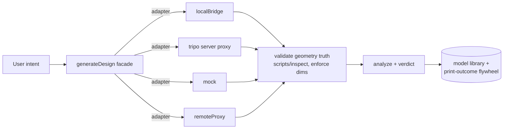

# 3DP Agent — Design-Layer Refactor Plan

**Status:** approved · **Version:** 1.0 · **Date:** 2026-08-14
**Scope:** `client/src/design/**` + generation-side server wiring (`cadBridge`, `meshProcess`, Tripo proxy)
**Companion doc:** `docs/design/architecture.md` (living), `docs/CAD_STUDIO_V2.md` (product v2)

> This plan is the answer to one question: *"are the seams in the generation
> layer the right seams?"* — Not "how do we patch the current seams," but
> "which seams should exist at all."

---

## 0. Executive summary

The product's **contract layer is excellent** — typed error unions, abort
semantics, inbound STL validation, error-code allowlists (`fetchGeneration.ts`)
are the strongest asset in the codebase. The **abstraction layer is not**: two
parallel generator interfaces that are conceptually the same thing but shaped
incompatibly, a dead factory layer (`createCadGenerationService`, zero call
sites), and a text-driven parametric editing path that will fight us at scale.

This plan collapses the generation layer onto **one contract**, makes
parametric editing **data-driven**, promotes geometry verification to a
**first-class pipeline stage**, and seeds the **model library + print-feedback
flywheel** that separate this product from every analysis tool that stops at
prediction.

---

## 1. Current state — verified facts (2026-08-14)

| # | Fact | Evidence |
|---|------|----------|
| 1 | Two parallel generator abstractions | `CADGenerationTransport` (sync `generate → outcome`) vs `MeshGenerationProvider` (async `submit → poll`) — zero shared surface |
| 2 | `createCadGenerationService` is dead code | Factory defined, exported, **zero call sites** incl. tests; body is a pass-through (`return await transport.generate(...)`) |
| 3 | Both workspaces hand-roll their own call path | `CADWorkspace.handleGenerate` and `MeshStudio.generate` each implement their own health-check + submit + poll + error mapping |
| 4 | Parametric editing is regex surgery on Python source | `CADWorkspace.applyParamChanges` rewrites `name = <literal>` via `RegExp` |
| 5 | Geometry verification does not run | `cadBridge` sets `validation: { ran: false, checks: ['scripts/inspect not run by bridge (v1)'] }` |
| 6 | `maxDimensionMm` is a prompt hint only | Constraint is concatenated into the LLM user message; never enforced on the artifact |
| 7 | Mesh repair is user-invoked, not pipeline | `MeshStudio.handleProcess` is a manual button; generation path analyzes raw Tripo STL |
| 8 | Tripo key ships in the client bundle | `const TRIPO_KEY = import.meta.env.VITE_TRIPO_API_KEY` (Vite env is public) + direct browser → api.tripo3d.ai calls |
| 9 | Poll loop has no budget | `MeshStudio` while-loop polls every 2s forever; `signal` only reaches `submit`, not `poll` |
| 10 | `mesh_process.py` stdout contract is fragile | Diagnostics travel via `print(json.dumps(diag))`; any stderr/stdout noise from trimesh/pymeshfix corrupts the JSON parse → silent `diagnostics = {}` |

---

## 2. Design principles (the "why" behind every decision)

1. **One seam per concept.** A "generator that produces an STL from a prompt"
   is one concept. Sync execution is a special case of async job (completes
   immediately). Two shaped differently = two places for bugs and drift.
2. **The pipeline is real, not decorative.** Stages that are just sequential
   `await`s with labels teach users nothing and enforce nothing. Verification
   that "didn't run" cannot be called a gate.
3. **Source is data, not a string.** Parametric intent must be a schema + value
   map, bound deterministically server-side with tests. Regex mutation of
   generated Python is a v1 crutch, not an architecture.
4. **Validation never leaves the server.** Geometry truth (STEP/B-rep) is the
   only thing factories can trust. Tessellated STL is for display and fast
   client analysis; authoritative checks belong to the solid.
5. **The contract layer is sacred.** `fetchGeneration`'s inbound assertions
   (mm units, non-empty, inline artifact, error-code allowlist) move verbatim
   into the new facade. No assertion is dropped or weakened.
6. **Policy over shared machinery.** Three subprocess runners (build123d venv,
   mesh venv, slicer CLI) have genuinely different execution environments.
   We share a *declared policy* (per-executor limits) and a *thin* ulimit
   fixture — we do not force one code path onto three environments.

---

## 3. Target architecture

```
                      ┌────────────────────────────────────────────────┐
                      │          consumer facade: generateDesign()     │
                      │  submit → poll(budget/backoff) → materialize   │
                      │  STL → contract validation → typed Outcome     │
                      └───────────────────┬────────────────────────────┘
                                          │ uses
              ┌───────────────────────────┼───────────────────────────┐
              ▼                           ▼                           ▼
   ┌────────────────────┐     ┌────────────────────┐     ┌────────────────────┐
   │  GeneratorTransport│     │  GeneratorTransport│     │  GeneratorTransport│
   │  (interface)       │     │  (interface)       │     │  (interface)       │
   └─────────┬──────────┘     └─────────┬──────────┘     └─────────┬──────────┘
             ▼                          ▼                          ▼
   ┌────────────────────┐     ┌────────────────────┐     ┌────────────────────┐
   │ localBridge        │     │ tripo (via server) │     │ mock / remoteProxy │
   │ sync: submit=done  │     │ async: submit+poll │     │                    │
   └─────────┬──────────┘     └─────────┬──────────┘     └─────────┬──────────┘
             └──────────────────────────┼──────────────────────────┘
                                        ▼
                     ┌──────────────────────────────────┐
                     │  Server-side geometry truth      │
                     │  sanitize → validate (STEP/B-rep)│
                     │  → analyze (risk) → verdict      │
                     └──────────────────────────────────┘
```



### New module layout

```
client/src/design/
  generator/
    types.ts               // single GeneratorTransport contract + job lifecycle
    service.ts             // facade: submit → poll(budget/backoff) → materialize
                           //          → contract validation (absorbed from fetchGeneration)
    localBridge.ts         // cadBridge adapter (submit == succeeded)
    remoteProxy.ts         // hosted production path
    tripo.ts               // async job adapter + poll budget/cancel
    mock.ts                // demo adapter (existing mock, unmodified contract)
    createGenerator.ts     // capability selection
  mesh/                    // fold existing tripo/mock/types under generator/ (keep exports)
  transport/               // retire after migration (validation absorbed into service)
  cadGenerationService.ts  // DELETED (dead factory)
```

### The single contract

```ts
interface GeneratorJob { id: string; provider: string }
type GeneratorJobState =
  | { status: 'queued' | 'running' }
  | { status: 'succeeded'; stlBytes: ArrayBuffer; meta?: GeneratedArtifactMeta }
  | { status: 'failed'; reason: string };

interface GeneratorTransport {
  readonly id: string;
  isAvailable(): Promise<boolean>;
  submit(request: GeneratorRequest): Promise<GeneratorJob>;
  poll(handle: GeneratorJob, opts?: { signal?: AbortSignal }): Promise<GeneratorJobState>;
}

// facade returns the existing typed outcome union — nothing upstream changes shape
type GenerationOutcome =
  | { ok: true; result: CADGenerationResult }
  | { ok: false; error: CADGenerationError };
```

`localBridge.submit` completes synchronously → `poll` returns
`{ status: 'succeeded' }` on first call. Tripo/mock keep async semantics.
One contract, two latency profiles, zero duplicated shape.

---

## 4. Workstreams

### WS-1 — Single generator contract (P1, highest leverage)

**Do:**
- `generator/types.ts` + `generator/service.ts` per §3. `service.generateDesign`:
  health check → `submit` → `poll` with configurable budget + backoff + external
  abort → materialize STL bytes → **run the fetchGeneration assertions verbatim**.
- Adapters: `localBridge` (absorbs `transport/localBridge.ts`), `remoteProxy`,
  `tripo` (absorbs `mesh/tripoProvider.ts`, adds poll budget + `signal` to poll),
  `mock`.
- `CADWorkspace.handleGenerate` + `MeshStudio.generate` call the facade; delete
  per-workspace submit/poll/error-mapping duplication.
- Delete `cadGenerationService.ts` and `transport/` after migration.
- `tripo` adapter routes through a new server endpoint `/api/tripo` (see WS-5)
  so the key never reaches the bundle.

**Exit criteria:** both workspaces produce identical `GenerationOutcome`s via one
facade; 0 references to deleted modules; existing `design/__tests__` migrate and
pass.

### WS-2 — Data-driven parametric editing (P2)

**Do:**
- `cadBridge` accepts `params: Record<string, number>`; server-side binder rewrites
  only `name = <literal>` assignment lines inside the `# PARAM` block (unit-tested,
  mirrors today's client logic but server-side + deterministic).
- `CADWorkspace` sliders → `generate({ baseModel, params })`; delete
  `applyParamChanges` regex path.
- **End-state (later):** generated source declares `PARAMS = {...}` and binding =
  JSON merge — zero text surgery.

**Exit criteria:** slider regeneration never touches client-side strings; binder
covered by `cadParams` unit tests; template suite still green.

### WS-3 — Verification as a first-class pipeline stage (P1)

**Do:**
- `cadBridge` invokes `scripts/inspect` after a successful `step` run: set
  `validation = { ran: true, isSolid, volumeMm3, boundingBoxMm, checks }`.
- Enforce `maxDimensionMm` from the STEP bounding box — reject with
  `invalid-artifact` + clear message when violated.
- Mesh path: when `is_watertight === false`, **automatically** run deterministic
  repair + decimate through `meshProcess` as a pipeline stage (not a manual
  button), gated by `repairAvailable` reported from `/health`.
- UI stage list becomes driven by real pipeline state; `verdict` gate configurable
  `block | warn`.

**Exit criteria:** `validation.ran === true` on every generation; oversized
artifacts blocked server-side; Tripo STL auto-repairs without user action when
the server reports capability.

### WS-4 — Model library + lineage graph (P3)

**Do:**
- Minimal server store: `GeneratedModel` + analysis snapshot + params +
  `parentModelId` + print outcome (SQLite/JSON; no heavy deps).
- Revision-tree UI over the existing `parentModelId` seed.
- Print outcomes keyed by model id → feeds WS-6.

### WS-5 — Security hardening (P1, land with WS-1)

**Do:**
- `/api/tripo` server proxy: allowlist + rate-limit (reuse amd-proxy pattern);
  key lives server-side only. Remove `VITE_TRIPO_API_KEY` bundle usage.
- `baseModel.generatedModelId` validated with the same `/^[0-9a-f-]{20,}$/i`
  allowlist used by `/step`.
- `meshProcess` subprocess gains the ulimit wrapper (shared policy per §2.6) +
  `MESH_PROCESS_TIMEOUT_MS` stays clamped; add STL triangle-count guard.
- Fix `mesh_process.py` stdout contract: emit a sentinel line or write the JSON
  to a sidecar file — no silent `diagnostics = {}`.

**Exit criteria:** no provider key in any client bundle; path allowlist uniform;
mesh runner enforces declared limits; empty-diagnostics failure mode eliminated.

### WS-6 — Print-outcome flywheel (P3, strategic moat)

**Do:** move `recordPrintOutcome`/`getPrintStats` off `localStorage` to the WS-4
store, keyed by model/analysis hash. Prediction (risk score, support volume,
print-time estimate) vs actual (success/fail/issues) calibration dashboard.

---

## 5. Phasing, risk, and sequencing

| Phase | Workstreams | Risk | Notes |
|-------|-------------|------|-------|
| **P1** | WS-1, WS-3, WS-5 | High-leverage, touches every generation call path | The `fetchGeneration` assertions are the crown jewels — migration is verbatim, test-locked |
| **P2** | WS-2 | Touches build123d template convention | Gate behind template regression suite |
| **P3** | WS-4, WS-6 | Data model + store; closest to commercial | Independent schedule; do not block P1/P2 |

**Ordering rationale:** P1 removes the abstraction debt and the security holes in
one pass (Tripo key, poll budget, stdout contract, verification gap all land
together). P2 is blocked only by templates. P3 is a product/data decision and is
deliberately decoupled.

**Rollback:** each WS lands as an isolated, test-green commit on its own branch;
the facade keeps the existing `GenerationOutcome` shape so upstream
(`CADWorkspace`/`MeshStudio`) can be migrated incrementally, commit-by-commit.

---

## 6. Definition of done (per workstream)

- [ ] `pnpm check` clean (strict TS)
- [ ] `pnpm test` green (incl. migrated `design/__tests__` + new service/adapter tests)
- [ ] `pnpm run build` passes
- [ ] CI gates green (`ci.yml`: check / test / build; `secret-scan.yml`: full-history)
- [ ] No provider key in any shipped bundle (`VITE_*` secrets removed)
- [ ] `validation.ran === true` on every generated model
- [ ] Zero references to retired modules

---

## 7. Appendices

### 7.1 Seams that stay (do not touch)
- `slicerBridge` / `slicerRouter` — absolute-path whitelist, `dropStlToBed`
  boundary check, DI-testable. Good as-is.
- `server/loopbackGuard.ts` + `bridgeAuth` — keep BRIDGE_TOKEN semantics.
- `fetchGeneration` validation logic — moves, does not change.
- Analysis/gate pipeline (`runCadAnalysis`, `CADConfidenceReport`) — untouched.

### 7.2 Model registry inconsistency (noted, owned elsewhere)
`LLM_CONFIGS` (client, CAD) vs `LLM_ALLOWED_MODELS` (server, relay) are two
registries. Owned as a follow-up; not in scope for this refactor's P1.
